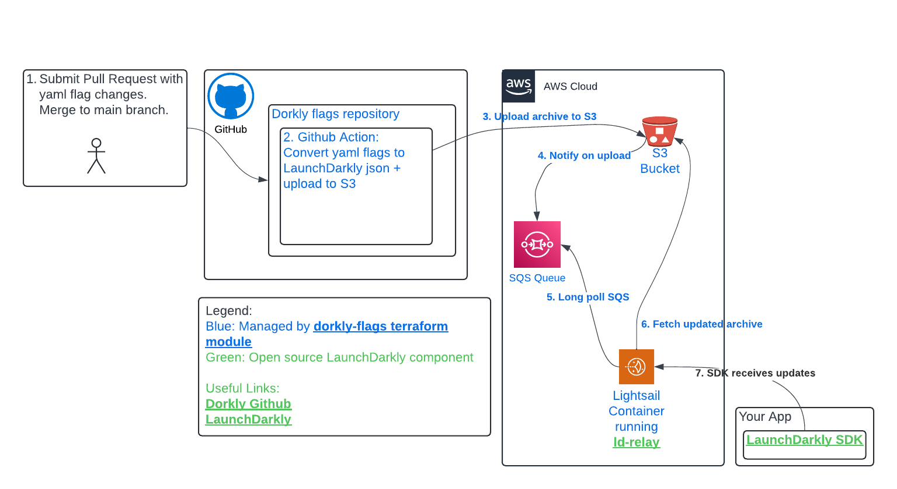

# Dorkly Feature Flags
Open Source Feature Flag system.
Dorkly is a git-based open source feature flag backend for [LaunchDarkly](https://launchdarkly.com/features/feature-flags/)'s open source SDKs.

It strives to be a simple feature flagging system without the cognitive load of yet another tool. If you're feeling fatigue from too many SaaS products then this might be if interest to you.
Example flags repo: [dorkly-flags-example](https://github.com/dorklyorg/dorkly-flags-example)

## Status
This project is in the early stages of development. Your feedback is appreciated. Early adopters, tire-kickers, and contributors are welcome. It's not to late to make major changes!

## Parity with LaunchDarkly
LaunchDarkly is a powerful system with a lot of features. Dorkly is a subset of that functionality. Here's what is supported so far:
1. One [project](https://docs.launchdarkly.com/home/getting-started/vocabulary#project) per git repo. If you need more projects create more repos.
2. Boolean flags: either on or off, or a percent rollout based on user id
3. [Server-side flags and client-side](https://docs.launchdarkly.com/sdk/concepts/client-side-server-side) flags (can exclude client-side on a per-flag basis)
4. Secrets management: SDK keys are stored in AWS Secrets Manager and exported as Terraform outputs. They are also displayed in the generated environment READMEs. [Example](https://github.com/dorklyorg/dorkly-flags-example/tree/main/project/environments/dev)

Components include (all managed by the [dorkly-flags Terraform module](https://registry.terraform.io/modules/dorklyorg/dorkly-flags/aws/latest):
1. Feature flag definitions stored as yaml files in a GitHub repository. [Example](https://github.com/dorklyorg/dorkly-flags-example)
2. A [GitHub Action](https://github.com/dorklyorg/dorkly): Reads in human-friendly yaml files, and converts them to an archive format consumed by:
3. A [Docker container](https://github.com/dorklyorg/dorkly/blob/main/docker/Dockerfile): Serves the flags to your application. This is a very thin wrapper around the [ld-relay](https://docs.launchdarkly.com/sdk/relay-proxy) appliance running in [offline mode](https://docs.launchdarkly.com/sdk/relay-proxy/offline)

# Getting Started: One time setup
## First steps
1. Determine your [project](https://docs.launchdarkly.com/home/getting-started/vocabulary#project) scope and come up with a short name.
2. Determine your starting [environments](https://docs.launchdarkly.com/home/getting-started/vocabulary#environment). These can be changed later so it's ok to use the defaults.
3. Provision your infrastructure using the [dorkly-flags Terraform module](https://registry.terraform.io/modules/dorklyorg/dorkly-flags/aws/latest). [Example](https://github.com/dorklyorg/terraform-aws-dorkly-flags/blob/main/examples/main/main.tf)

## Setting up your application with a properly configured LaunchDarkly SDK
Instructions and examples are auto-generated for each environment in the GitHub repo. Once your infrastructure is provisioned, you can find the instructions in the `project/environments/<env>/README.md` file.
You can also look at dev environment in the [example flags repo](https://github.com/dorklyorg/dorkly-flags-example/tree/main/project/environments/dev)

Best practices suggest wiring in all properties via terraform (the module outputs the necessary values). However, you can also manually configure the SDK.

# Common Tasks
## Adding a feature flag
In your newly created GitHub repo you'll notice some example yaml files under the `project/` directory. These are intended to be a starting point, so you can create additional yaml files for your own flags.
1. Create a flag overview file for the project. Each flag's basic properties are defined at the project level. This includes name, description, and the type of flag (boolean, booleanRollout, etc). This file should be created in the `project/flags` directory. The naming convention is `<flagName>.yml`. Check out the example flags as a starting point.
2. Create environment-specific flag config files. Under each environment directory in `project/environments`, create a file with the same name as the flag file. This file will contain the environment-specific configuration for the flag. The naming convention is `<flagName>.yml`. Check out the example flags as a starting point.
3. *Not yet implemented but needed for MVP*: Pull Request checks will validate your changes for well-formedness.
4. Commit your changes to the main branch. The GitHub Action will automatically pick up the changes and update the backend service.

## Changing a feature flag for an environment
1. Update the flag file in the environment directory.
2. Commit your changes to the main branch. The GitHub Action will automatically pick up the changes and update the backend service.

## Adding an environment
1. Navigate to your Terraform config
2. Add a new environment to the `environments` variable and execute the changes.
3. Once your Terraform run has been applied, you can add flag configs for the environment manually, or by copying the contents of an existing environment.

## Helpful Links
LaunchDarkly documentation:
* [Feature Flags](https://launchdarkly.com/features/feature-flags/)
* [SDK Types](https://docs.launchdarkly.com/sdk/concepts/client-side-server-side)
* [Relay Proxy Configuration](https://docs.launchdarkly.com/sdk/features/relay-proxy-configuration/proxy-mode)
* [Relay Proxy SDK config](https://docs.launchdarkly.com/sdk/relay-proxy/sdk-config)

## Architecture
